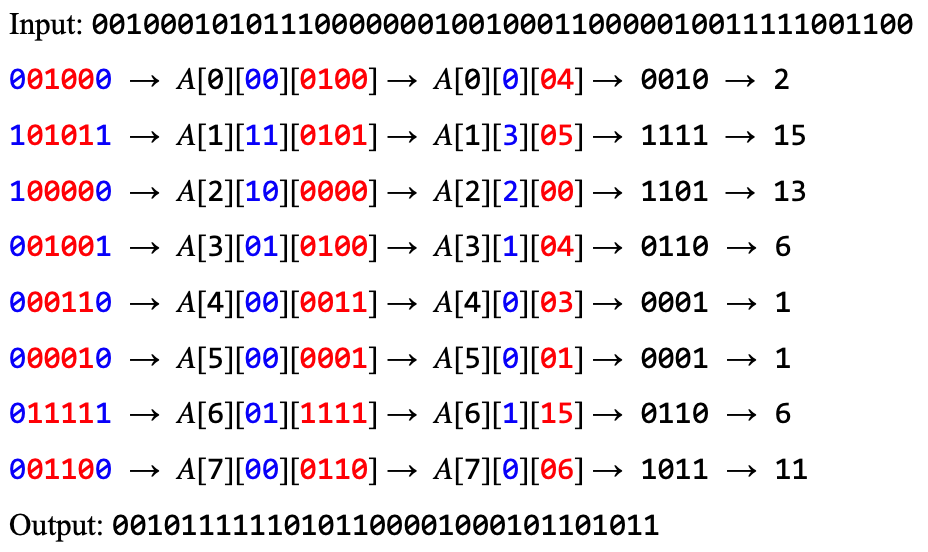

# TripleDES:

This C++ file is an implementation of the encryption algorithm Triple Data Encryption Standards. This project was created solely for educational purposes to understand how modern encryption algorithms work.

*Warning: This is exclusively for educational purposes and should not be used for encrypting user data! (Modern encryption is computed by more optimized and efficient methods)*

## How to run:

To run the project you would run the file `build.sh` that would generate the executable `test` and run it. 

*Note: `build.sh` uses clang, if you are not using a Unix system this file will not allow you to compile.*

## How to use:

The file includes a class named `TripleDES` that contains multiple methods to modify data. To encrypt or decrypt, you need 3 different 128-bit keys stored as hexadecimal and then a hexadecimal input that is also 128 bits long.

### Methods:

To encrypt and decrypt data, the class was reliant on multiple different methods that converted the data based on either an array or other values. The class converts the data between binary and hexadecimal to make the format a bit cleaner when demonstrating it. Here is a list of all the methods used by the class:

- `binaryToHex`: converts binary text to hexadecimal text
- `hexToBinary`: converts hexadecimal text to binary text
- `applyRound`: since there are many rounds to DES this does an individual round
- `applySubstitutionBox`: converts the inputted data based on the substituionBox array
- `shiftKeyWith`: changes the key based on the spacing needed
- `generateModifiedKeys`: creates a huge list of all the modified keys in the rounds
- `xorStringAddition`: combines two binary strings together in the xor format (1 + 1 == 0, 0 + 0 == 0, 1 + 0 = 1)
- `permutate`: this is the function used to rearrange data based on an array
- `reverse`: this reverses an array (primarily used for decryption because it's the same as encryption but backward)
- `encrypt`: this encrypts the data using the symmetric 3 keys
- `decrypt`: this decrypts the data using the symmetric 3 keys
- `singleEncrypt`: this encrypts the data using one symmetric key
- `singleDecrypt`: this decrypts the data using one symmetric key

### Substitution Boxes & Permutation:

The class contains multiple different arrays that store how data can be permutated and modified so that it is able to encrypt the data. Here's a list of all the permutation arrays from the `TripleDES` class:

- `keyRemove8thBits`: The permutation data for converting the key from 64-bit to 56-bit
- `shiftKeyTable`: The amount of keys that move
- `keyCompressionArray`: The permutation data for converting the key from 56-bit to 48-bit
- `initialPermutation`: the table of how the 64 bits are mangled in the beginning of the conversion
- `expandingDataFrom32to48`: The permutation data for expanding the data from 32 bits to 48 bits
- `shrinkingDataFrom48to32`: The permutation data for shrinking the data from 48 bits to 32 bits
- `substituionBox`: Substitution Box Table to change the data from one to the other
- `finalPermutation`: the table of how the 64 bits are mangled at the end of the conversion

Here is an example of how a substitution box can be used:



## Sample Inputs and Outputs:

### Core Functions:

To encrypt the whole data you would do the following:
```c++
string text = "123456ABCD132536";
// this is the the input data

string key1 = "AABB09182736CCDD";
string key2 = "B8091827AACCDD36";
string key3 = "22B8091827CC89AA";
// these are the keys

string keys[3] = {key1, key2, key3};
// this is an array for all the keys

text = des->encrypt(text, keys);
// encrypts the text

cout << text << endl;
// prints B3473CB382890AED

text = des->decrypt(text, keys);
// decrypts the text

cout << text << endl;
// prints 123456ABCD132536
```

- *Note: All the data above is represented as hexadecimal strings.*

Using the encrypting and decrypting functions will also print all the rounds that are being produced as the rounds are being accomplished and separately for every key that is being used. 

Here is an example of the input (`123456ABCD132536`) being encrypted using the first key (`AABB09182736CCDD`) and all the different rounds with the data being split and modified as it's being encrypted:

```
ENCRYPTED DATA:123456ABCD132536
After initial permutation: 14A7D67818CA18AD
After splitting: L0=14A7D678 R0=18CA18AD
Round 1 18CA18AD 5A78E394 194CD072DE8C
Round 2 5A78E394 4A1210F6 4568581ABCCE
Round 3 4A1210F6 B8089591 06EDA4ACF5B5
Round 4 B8089591 236779C2 DA2D032B6EE3
Round 5 236779C2 A15A4B87 69A629FEC913
Round 6 A15A4B87 2E8F9C65 C1948E87475E
Round 7 2E8F9C65 A9FC20A3 708AD2DDB3C0
Round 8 A9FC20A3 308BEE97 34F822F0C66D
Round 9 308BEE97 10AF9D37 84BB4473DCCC
Round 10 10AF9D37 6CA6CB20 02765708B5BF
Round 11 6CA6CB20 FF3C485F 6D5560AF7CA5
Round 12 FF3C485F 22A5963B C2C1E96A4BF3
Round 13 22A5963B 387CCDAA 99C31397C91F
Round 14 387CCDAA BD2DD2AB 251B8BC717D0
Round 15 BD2DD2AB CF26B472 3330C5D9A36D
Round 16 CF26B472 19BA9212 181C5D75C66D
ENCRYPTED DATA:C0B7A8D05F3A829C
```

### Helper Functions:

Here are the methods to convert hexadecimal to binary and the vice versa:

```c++
cout << des->hexToBinary("F98FA3210FBC228A") << endl;
// prints 1111100110001111101000110010000100001111101111000010001010001010

cout << des->binaryToHex("1111100110001111101000110010000100001111101111000010001010001010") << endl;
// prints F98FA3210FBC228A
```

Here is the exclusive or operation:
```c++
cout << des->xorStringAddition("001001", "011101") << endl;
// prints 010100
```

Here are some examples of permutation and shifting bits:
```c++
cout << des->shiftKeyWith("0100101", 1) << endl;
// prints 1001010

cout << des->permutate("1111100110001111101000110010000100001111101111000010001010001010" , des->initialPermutation, 64) << endl;
// prints 0000000100100001001100100001111110100111011011011011001111010110
```

## Sources:

Here are the core sources of my research I used to understand this algorithm.

*NOTE: All the pictures were created by me*

- [GeeksForGeeks](www.geeksforgeeks.org/data-encryption-standard-des-set-1/): www.geeksforgeeks.org/data-encryption-standard-des-set-1/
- [Data Encryption Standard:cs.mcgill.ca](www.cs.mcgill.ca/~rwest/wikispeedia/wpcd/wp/d/Data_Encryption_Standard.htm): www.cs.mcgill.ca/~rwest/wikispeedia/wpcd/wp/d/Data_Encryption_Standard.htm
